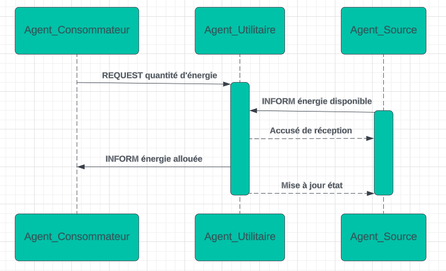
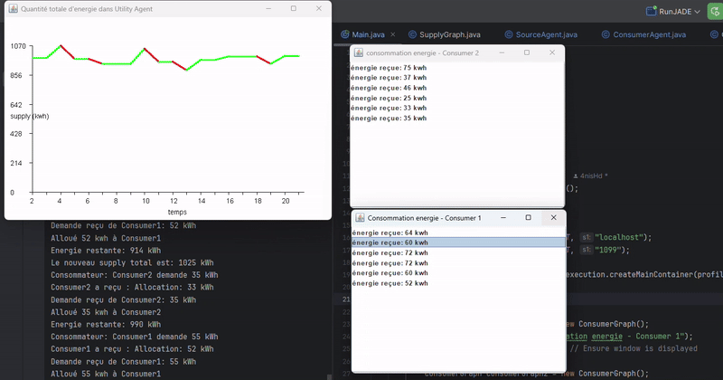

# Multi-Agent System for Distributed Energy Optimization

This project implements a **multi-agent system** using **JADE** to optimize energy distribution. The system employs **Agent Communication Language (ACL)** for inter-agent communication.

## Agent Types
1. **UtilAgent (Utility Agent):**
   - Serves as the system coordinator.
   - Aggregates energy demand and supply data.

2. **ConsumerAgent:**
   - Represents energy consumers.
   - Sends energy demand requests to the `UtilAgent`.

3. **SourceAgent:**
   - Represents energy providers.
   - Reports available energy resources to the `UtilAgent`.
   - Responds to allocation requests.

## Communication flow:

     
The system is scalable with modular design that supports adding more agents to simulate larger networks.

