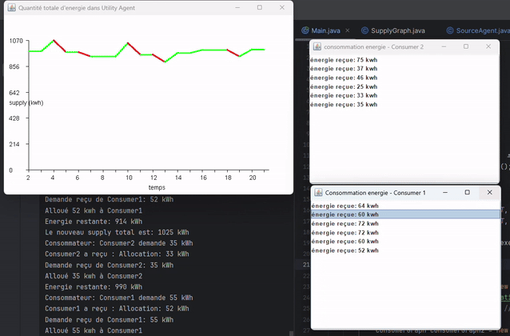

#A simple multi-agent system with JADE

This project implements a **multi-agent system** using **JADE** for energy distribution among different components in a power grid. The system employs **Agent Communication Language (ACL)** for inter-agent communication.

## Agent types
**UtilAgent (Utility Agent):**
   Serves as the system coordinator. Waits for requests from consumers and updates the available energy based on information received from sources. It then distributes the energy among consumers in a fair manner.

**ConsumerAgent:**
    Represents energy consumers, sends a request via a REQUEST message to the utility agent and then waits for a response via an INFORM message.

**SourceAgent:**
   Represents energy providers, ends an INFORM message to the utility agent to update energy availability.

   
The system is scalable with modular design that supports adding more agents to simulate larger networks.

## Communication flow:

     

## Demo using one utility, one source, and two consumers

